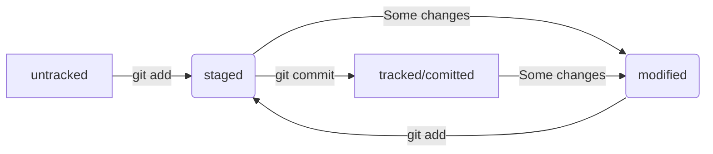

# Шпаргалка по Git
#### В этом проекте наша задача описать всё, что мы помним из курса.
## Работа с консолью
Такие команды, как `cd`, `mkdir`, `rm` (флаги: `-rf`), `touch`, `ls` (флаги: `-a`), `pwd`, `rmdir`, `cp`, `mv`, `cat` позволяют работать с директориями и файлами, перемещаться по ним и т.п. Так же мы знаем, что символ **~** обозначает домашний репозиторий, **/** - корневой репозиторий. Команда `cd ..` возвращает на один репозиторий назад по иерархии, а команда `cd .` оставляет пользователя в текущем репозитории. Символы **&&** используются, чтобы уместить несколько команд в одном запросе. С помощью клавиш `↑↓` можно перемещаться по истории команд, введённых пользователем. При нажатии на `Tab` консоль предложит несколько вариантов продолжения команды.
## Работа с Git
1. Инициализация локального репозитория осуществляется с помощью команды `git init`
2. Типичный алгоритм коммита-пуша:  
 ```bash
 git add .
 git commit -m "comment"
 git push -u origin main #первый пуш должен быть таким, но последующие - просто git push
 ```
3. Алгоритм создания и привязки удалённого репозитория:
    * Создаём удалённый репозиторий в `GitHub`
    * Генерируем `SSH`-ключ (не требуется, если процедура уже проводилась на этом устройстве):
      ```bash
      ssh-keygen -t ed25519 -C "электронная почта, к которой привязан аккаунт на GitHub"
      #далее просто жмём Enter
      ```
    * Копируем открытый ключ командой `cat ~/.ssh/id_rsa.pub` или `cat ~/.ssh/id_ed25519.pub` (не требуется, если процедура уже проводилась на этом устройстве)
    * Добавляем созданный ключ на `GitHub` (не требуется, если процедура уже проводилась на этом устройстве)
    * Привязываем удалённый репозиторий командой `git remote add origin <ссылка на удалённый репозиторий>` и убеждаемся, что репозитории связаны командой `git remote -v`  
      В выводе должны увидеть две строчки:
      ```bash
      origin    git@github.com:%ИМЯ_АККАУНТА%/%ИМЯ-ПРОЕКТА%.git (fetch)
      origin    git@github.com:%ИМЯ_АККАУНТА%/%ИМЯ-ПРОЕКТА%.git (push) 
      ```
4. Просмотр информации о коммитах:
 ```bash
 git log           #вывести подробную информацию о коммитах
 git log --oneline #вывести сокращённый хэш и комментарий коммита
 ```
5. Работа с коммитами:
    * Добавление изменений в последний коммит
      ```bash
      git commit --amend --no-edit            #добавить изменения к последнему коммиту и оставить сообщение прежним
      git commit --amend -m "Новое сообщение" #изменить сообщение к последнему коммиту
      ```
    * `Unstage` изменений (проще говоря - обратная команде `git add`) можно выполить командой `git restore --staged <file>`. Для сброса всех файлов - `git restore --staged`. 
      Откат статуса файла `modified` (или же откат изменений, которые ещё не подготовлены к коммиту) выполняется командой `git restore <file>`.
    * Откат коммита производится командой `git reset --hard <commit hash>`, где `<commit hash>` - хэш коммита, к которому хотим вернуться.
6. Просмотр изменений:
    * `git diff` выводит изменения, файлов в статусе `modified`;
    * `git diff <commit hash> <commit hash>` выводит изменения (разницу) между двумя коммитами;
    * `git diff --staged` выводит изменения, которые добавлены в `staged`-файлах.
7. Прочие команды для работы с `Git`:  
`git version` - показывает версию `Git'а`; 
`git config` - нужна для просмотра и изменений настроек `Git`; 
`git status` - выводит в консоль статусы файлов в локальном репозитории. `git status --ignored` - та же самая функция, но плюс к этому выводит игнорируемые файлы.
## Работа с Markdown
Мы научились работать с языком разметки `Markdown`, который и используется для создания этого файла.
## Лог и хэш коммита
Хеш — основной идентификатор коммита и позволяет узнать его автора, дату и содержимое закоммиченных файлов. Все хеши, а также таблицу соответствий `хеш → информация о коммите` `Git` хранит в папке `.git`.
С помощью команды `git log --oneline` можно получить сокращённый лог коммита, который состоит из нескольких первых символов хэша и комментария.
## HEAD
Файл `HEAD` — один из служебных файлов папки `.git`. Он указывает на коммит, который сделан последним (то есть на самый новый). Внутри `HEAD` — ссылка на служебный файл: `refs/heads/master`. Если заглянуть в этот файл, можно увидеть хеш последнего коммита.
## Статусы файлов в Git

В некоторых случаях файл может быть в статусах `staged` и `modified` одновременно (вернее было бы сказать, что разные версии этих файлов могут быть в этих двух статусах).
## Сообщения к коммитам
Сообщения должны быть:
- Относительно короткими
- Информативными
- Быть на английском языке
- Начинаться с заглавной буквы
- Быть в повелительном наклонении
- Разумеется, быть в одном стиле
## .gitignore
Файл `.gitignore` нужен, чтобы `Git` не добавлял в репозиторий файлы, указанные в `.gitignore`. В нём можно указать названия файлов, которые мы не хотим видеть в репозитории, но также возможны другие функции:
* Символ звёздочки `*` соответствует любой строке, включая пустую. Если такой символ используется в шаблоне в `.gitignore`, значит, файл будет проигнорирован вне зависимости от того, что будет на месте звёздочки;
* Вопросительный знак `?` соответствует одному любому символу.
* Квадратные скобки `[...]`, как и вопросительный знак, соответствуют одному символу. При этом символ не любой, а только из списка, который указан в скобках. В скобках можно либо перечислить символы `[abc]`, либо задать диапазон `[a-z]`.
* Cлеш `/`, указывает на каталоги. Если шаблон в `.gitignore` начинается со слеша, то `Git` проигнорирует файлы или каталоги только в корневой директории.
* Функция парных звёздочек `**` похожа на функцию одинарной `*`. Отличие в том, как они работают с вложенными папками. Двойная звёздочка может соответствовать любому количеству таких папок (в том числе нулю). Одинарная может соответствовать только одной.
* Любое правило в файле `.gitignore` можно инвертировать с помощью восклицательного знака `!`, т.е. файлы с такой меткой перед названием будут "исключением"  
Пример: 
```bash
*.jpeg     # игнорировать все JPEG-файлы

!doge.jpeg # но только не мем с Doge
```
Теперь файл `doge.jpeg` будет отслеживаться, хотя остальные `jpeg`-файлы будут проигнорированы. Такие правила удобны для добавления исключений из других правил `.gitignore`.