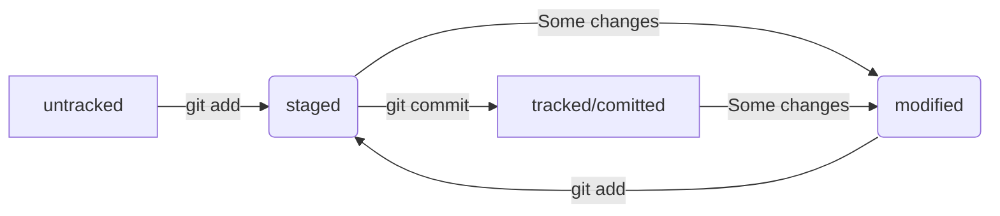

# test_project2
#### В этом проекте наша задача описать всё, что мы помним из курса.
## Работа с консолью
 Такие команды, как cd, mkdir, rm (флаги: -rf), touch, ls (флаги: -a), pwd, rmdir, cp, mv, cat позволяют работать с командной строкой. Так же мы знаем, что символ **~** обозначает домашний репозиторий, **/** - корневой репозиторий. Команда `cd ..` возвращает на один репозиторий назад по иерархии, а команда `cd .` оставляет пользователя в текущем репозитории. Символы **&&** используются, чтобы уместить несколько команд в одном запросе. С помощью клавиш `↑↓` можно перемещаться по истории команд, введённых пользователем. При нажатии на `Tab` консоль предложит несколько вариантов продолжения команды.
## Работа с Git
 Типичный алгоритм коммита:
 ```bash
 git add .
 git commit -m "comment"
 git push
 ```
 Есть и другие команды git'а: git version; git config; get init; git status; git log (позволяет просмотреть коммиты); git remote (флаги: -v); git remote add; git reset (отменяет последний коммит); git revert "commit hash" (отменяет изменения последнего коммита без удаления самого коммита).
 Так же мы узнали, как создавать SSH ключи.
## Работа с Markdown
 Мы научились работать с языком разметки Markdown, который и используется для создания этого файла.
## Лог и хэш коммита
 Хеш — основной идентификатор коммита и позволяет узнать его автора, дату и содержимое закоммиченных файлов. Все хеши, а также таблицу соответствий `хеш → информация о коммите` Git хранит в папке `.git`.
 С помощью команды `git log --oneline` можно получить сокращённый лог коммита, который состоит из нескольких первых символов хэша и комментария.
## HEAD
Файл `HEAD` — один из служебных файлов папки `.git`. Он указывает на коммит, который сделан последним (то есть на самый новый). Внутри HEAD — ссылка на служебный файл: `refs/heads/master`. Если заглянуть в этот файл, можно увидеть хеш последнего коммита.
## Статусы файлов в Git



В некоторых случаях файл может быть в статусах staged и modified одновременно (вернее, разные версии этих файлов могут быть в этих двух статусах).
## Сообщения к коммитам
Сообщения должны быть:
- Относительно короткими
- Информативными
- Быть на английском языке
- Начинаться с заглавной буквы
- Быть в повелительном наклонении
- Разумеется, быть в одном стиле